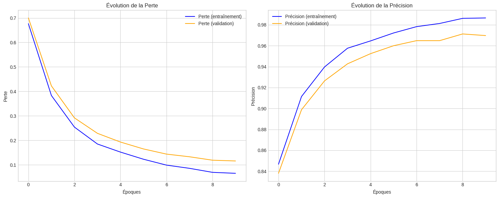
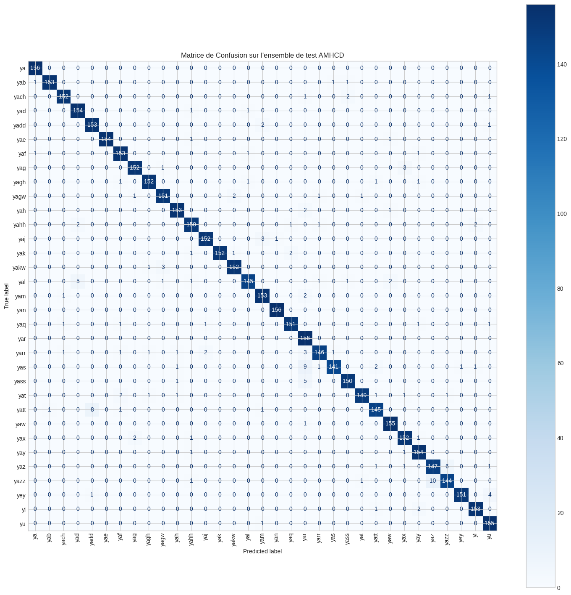

# LeNet-5 for Tifinagh Character Recognition


## 1. Overview

This repository contains a complete, implementation of the LeNet-5 convolutional neural network (CNN) in Python using NumPy. The project was developed to gain a fundamental understanding of the internal mechanics of CNNs and to apply this historical architecture to a modern and culturally relevant task: the classification of the 33 handwritten characters of the Tifinagh (Amazigh) alphabet.

The entire learning pipeline, including all neural network layers (Convolutional, Pooling, Dense), activation functions, the backpropagation algorithm, and the training loop, was implemented manually without relying on high-level deep learning frameworks like TensorFlow or PyTorch.

---

## 2. Core Objectives

-   **Implement LeNet-5 from Scratch:** Manually code each layer and the backpropagation mechanism using NumPy.
-   **Apply to a Custom Dataset:** Train and evaluate the model on the Amazigh Handwritten Character Database (AMHCD).
-   **Analyze Performance:** Critically analyze the model's performance using learning curves, a confusion matrix, and per-class metrics.
-   **Interpret Internal Mechanics:** Visualize feature maps to understand what the convolutional layers are learning.
-   **Produce a Detailed Report:** Document the entire process, from theory to implementation and results, in a comprehensive academic report.

---

## 3. Architecture: Adapted LeNet-5

The model follows the classic LeNet-5 architecture, adapted for 33 output classes.

-   **Input:** 32x32x1 Grayscale Image
-   **C1:** Convolutional Layer (6 filters, 5x5 kernel)
-   **S2:** Average Pooling Layer (2x2, stride 2)
-   **C3:** Convolutional Layer (16 filters, 5x5 kernel)
-   **S4:** Average Pooling Layer (2x2, stride 2)
-   **Flatten:** Reshape for fully connected layers
-   **C5:** Fully Connected Layer (120 neurons)
-   **F6:** Fully Connected Layer (84 neurons)
-   **Output:** Fully Connected Layer (33 neurons) + Softmax

---

## 4. Dataset

The model is trained on the **Amazigh Handwritten Character Database (AMHCD)**, which can be found on Kaggle. This dataset contains over 25,000 images across 33 classes corresponding to the Tifinagh alphabet characters.

---

## 5. Technologies Used

-   **Language:** Python 3
-   **Core Libraries:**
    -   `NumPy`: For all numerical computations and building the network from scratch.
    -   `OpenCV (cv2)`: For image loading and preprocessing.
    -   `Scikit-learn`: For data splitting and performance metrics (confusion matrix, classification report).
    -   `Matplotlib`: For all data visualizations.
-   **Environment:** Google Colaboratory (Colab)

---

## 6. How to Run the Code

The entire project is contained within the `LeNet5_Tifinagh.ipynb` Jupyter Notebook. To replicate the results, follow these steps:

1.  **Clone the Repository:**
    ```bash
    git clone [https://github.com/is-wael/LeNet5-Tifinaghe.git](https://github.com/is-wael/LeNet5-Tifinaghe.git)
    cd LeNet5-Tifinaghe
    ```

2.  **Open in Google Colab:** Upload and open the `LeNet5_Tifinagh.ipynb` file in Google Colab.

3.  **Kaggle API Key:** When prompted by **Cell 2**, upload your `kaggle.json` API key. You can generate this key from your Kaggle account page under the "API" section. This step is necessary to download the AMHCD dataset automatically.

4.  **Run All Cells:** Execute all cells in the notebook from top to bottom. The notebook is structured to handle all steps sequentially:
    -   Environment setup
    -   Data download and preprocessing
    -   Model definition and training
    -   Results visualization

---

## 7. Results Summary

The from-scratch LeNet-5 model achieved a high level of performance on this complex 33-class classification task.

-   **Peak Validation Accuracy:** **97.13%**

#### Learning Curves


The learning curves show a smooth convergence with a minimal gap between training and validation sets, indicating good generalization.

#### Confusion Matrix


The confusion matrix shows a strong diagonal, confirming high accuracy across most classes, with minor confusions between visually similar characters.

---

